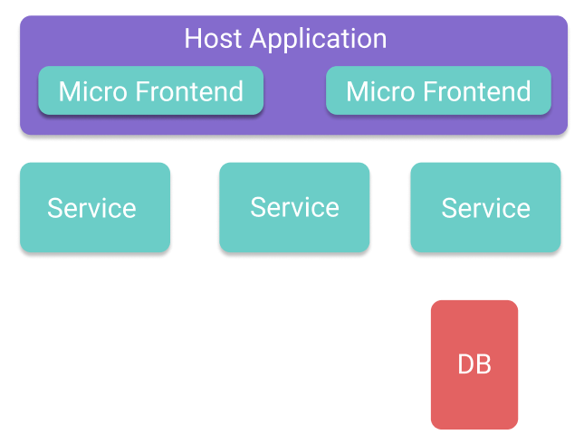

The shift in recent years from monoliths to microservices has been one of the most impacting for the tech community. Many big teams realized that there is value in splitting up the backend into several smaller pieces.
Micro frontends are an architectural pattern that tries to replicate the success of microservices in the backend. This blog post reflects my thoughts and learnings on micro frontends focusing mainly on what they are and why they can be useful.

## How Did We Get Here?

On Christmas in 2014, Sam Newman published his book “Building Microservices: Designing Fine-Grained Systems.” This book became the first book that summarized all the approaches around building distributed systems composed of several smaller (micro) services. It also was the first that actually codified many practices that we still use to this day.
At the same time, there was a lot of movement in the frontend space. Just one year earlier, Facebook published the first version of React, which arguably is today’s most used frontend framework. So while many backend engineers were splitting up the backend into many small services, the frontend space exploded with new frameworks and new possibilities. Writing frontend was now much more powerful, and new frameworks started to pop up all over the place. Frontend frameworks made it easier to create complicated user interfaces resulting in a lot of logic implemented in the frontend. Today, it is not uncommon to find applications, which have an architecture similar to the one seen below. The next big challenge for tech is finding ways to split up the frontend into several cohesive smaller parts, just like it has been done in the backend.

While the backend has done a lot of work analyzing patterns for microservices, the frontend is only at the beginning of this process. There are not yet clear principles and established best practices around creating micro frontends. In the next sections, I want to dive deeper into the current state of micro frontends, what they are and when and why you should consider applying this pattern.

## What Are Micro Frontends?

So what is a micro frontend? I really like the definition from Luca Mezzalira, the former Chief Architect at DAZN:

**What Are Micro Frontends:**

<Quote by="Luca Mezzalira" source="https://www.youtube.com/watch?v=tD1rcWSfYpo">
  Micro Frontends are the technical representation of a business subdomain. They
  provide strong boundaries with clear contracts; also, they avoid sharing logic
  with other subdomains.
</Quote>

So this is a lot of definition. Let’s unpack this piece by piece. Let’s imagine an e-commerce application where you can add items to your cart, and when you log in, you have a “My Account” section. There are at least two business subdomains in this application: the first subdomain is the whole “My Account” section, where the user can edit his user details. Another subdomain is the Shopping Cart. The logic of the Shopping Cart can be completely separate from the “My Account” section.
You can implement both of these two subdomains with separate technologies: e.g., one part is implemented by one team in Vue, and the other part is implemented in React. So in this example, micro frontends are two pieces of UI that can be technologically independent but live together on a host page.

What I particularly enjoy about Luca’s definition is that it mentions clear contracts and strong boundaries. I think this is particularly important. You see, it has always been possible to have multiple frameworks on the same webpage, but I think that there is a big difference between a rouge Vue component in a React application and a precise architecture that follows some guiding principles.
What makes a micro frontend different from a rouge component is that the micro frontend is modeled around the same principles as a microservice. Sam Newman specified these in one of his talks (find the link <a href="https://samnewman.io/talks/principles-of-microservices" target="_blank">here</a>):

- Modeled around Business Domain
- Culture of Automation
- Hide Implementation Details
- Decentralize All The Things
- Deploy Independently
- Isolate Failure
- Highly Observable

I think Sam Newman nailed it when he published these, and they surprisingly fit for the frontend as well.

  

    <strong>A Note on Domain Driven Design</strong>
  

  

    Domain-Driven Design heavily inspires the terminology of this definition.
    While I am not really the right person to explain DDD properly, the main
    concept outlined here is about identifying smaller subdomains in an
    overarching business domain and drawing boundaries around them. It is a
    practice commonly applied to microservices, and it is a helpful practice to
    answer the question: “What constitutes a microservice, and where are the
    boundaries of the service.”
  

## What Are the Advantages of Micro Frontends?

So why would you want to have multiple frontend frameworks on the same website? Usually, a team decides to do micro frontends for one of two reasons: The first one is that the team is too big to work on the same code base. Imagine a huge organization with 20 or more people working on the same frontend application. This is a tremendously large team and a huge application. Communication overhead can become a real problem. Also, all the branching and the timing of the features can become anything but straightforward as multiple developers might work on the same pieces of code in parallel. As the system scales to a point where more than one team works on one monolithic frontend application, you probably should start to consider if micro frontends are a possible solution for you. The advantage is that teams ideally can start, plan, and even deliver their features independently (this is made possible by technologies like module federation).

The second reason why micro frontends might be a pattern for you is when you are trying to move from one frontend framework to another. If you are going about this rewrite iteratively, there will be moments when you need to develop and deploy two frameworks at the same time.

## What Are the Disadvantages of Micro Frontends

_"You will not go faster with micro frontends, but you will not get slower as your team grows."_ This was mentioned in a talk online about micro frontends, and it really resonated with me. In the backend, microservices were a fad that swept the community in the last years. Microservices are an amazing pattern, but all too often, teams that did not really need to do microservices adopted this pattern and bought into a whole plethora of problems that they could have avoided with a simple monolith. The same holds true for micro frontends. Unless you have a problem like the ones discussed above, you probably should evaluate very carefully if you want to adopt the extra complexity and if your team can handle it.

One of the complexities around micro frontends is having a consistent UI across all components. As all teams can move at different speeds and have their own tools, creating a harmonious UI can become a challenge. Let’s go back to the example of the “Shopping Cart” and the “My Account” section. Let’s assume both micro frontends need to provide a form: In the “My Account” section, you need to enter your preferred delivery address, and in the “Shopping Cart,” you can provide a coupon code. Ideally, both of these forms will implement the same design tokens. Even better, they would use the same CSS to ensure consistency. However, you very likely need to implement these forms and all the relating styles twice in a micro frontend setup. There are ways of sharing these design tokens, but regardless of the solution, you find it will not be as simple as it is with a monolithic frontend application.

## Conclusion

I spent the last weeks researching this topic because I believe that micro frontends are the next frontier for frontend engineering. They are here to stay because they solve a similar problem as we had for years in the backend, and these problems are big and worth solving. I did not go too much into the “How to do micro frontends” as I think I will write a separate blog post about it, I also need to get more experience with these patterns. Still, you can find an amazing <a href="https://martinfowler.com/articles/micro frontends.html" target="_blank"> article</a> on Martin Fowler’s website that will detail how you can realize this architecture. Within the next couple of years, I think this topic will become more prominent and we will see the rise of more “meta” frameworks like Single SPA, which will manage the complexity around the communication between multiple micro frontends. Exciting times are up ahead.
