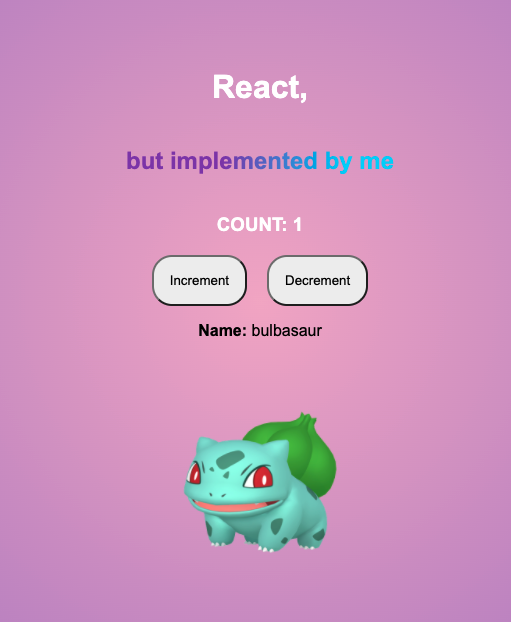

I implemented the library react from scratch by only using 200-300 lines of code. I also implemented hooks (as closures - see [my blog post about react hooks and closures](https://maxklammer.com/blog/react-hooks-and-closures/) ). The coolest thing is that I also implemented Concurrent React, which is one of the major updates to React that is going to be released in React 18. Note that this is all heavily inspired by veterans of the industry, especially by [Rodrigo Pombo](https://pomb.us/build-your-own-react/) and [Swyx](https://www.youtube.com/watch?v=yeyiA9U8Ep8). Check out their original content for more details.

## Implemented Components

- **JSX**: You can just use the Babel preset and run it in your build job to take JSX and convert it into objects.
- **Create HTML Elements from JSX:** Once the JSX has been transformed we need to update some functions that create the Elements on the DOM should I need it.
- **React Fiber:** We need to recreate the React Fiber architecture (basically linked lists) in order to efficiently recurse over all React elements and to traverse back to the root.
- **Work Loop:** In order not to block the main thread we need a work loop that executes a unit of work every time the main thread is idle. We can do that by using the `requestIdleCallback` function of the browser.
- **Reconciliation:** We need a process that checks if the component should re-render or not. Basically, we are comparing our internal state, with the state of the DOM and re-render the nodes that have changed. Note that in the `alternate` property we store the previous “state” of the fiber. Like this, we can check if it has changed.
- **Batch Updating:** We do not update the DOM on every change, rather we calculate the changes beforehand and then commit to the DOM.
- **`useState` hook**: In order to have some re-renders and to update the DOM.
- **`useEffect` hook**: Fetch some pokemon over an API and update the state. Run the hook based on dependencies.

## Result

## Notes:

There are essentially three main parts to the logic:

- The work loop starts the reconciliation process and works on it whenever the main thread is idle. Once all fibers have been created/updated we commit all the work to the DOM.
- The reconciliation process that creates the fibers and updates the fibers should something change.
  - Loops through all the fibers (performUnitOfWork)
- The commit phase loops over the previously created fibers and creates the DOM.
  - Creates, updates and deletes the fibers based on the effect tag.

## Links:

- Code Sandbox: [my-react](https://codesandbox.io/s/github/misterbracket/react-from-scratch)
- Original Blog Post: [Build your own React](https://pomb.us/build-your-own-react/)
- Code Walkthrough with Swyx: [Video](https://www.youtube.com/watch?v=yeyiA9U8Ep8)
