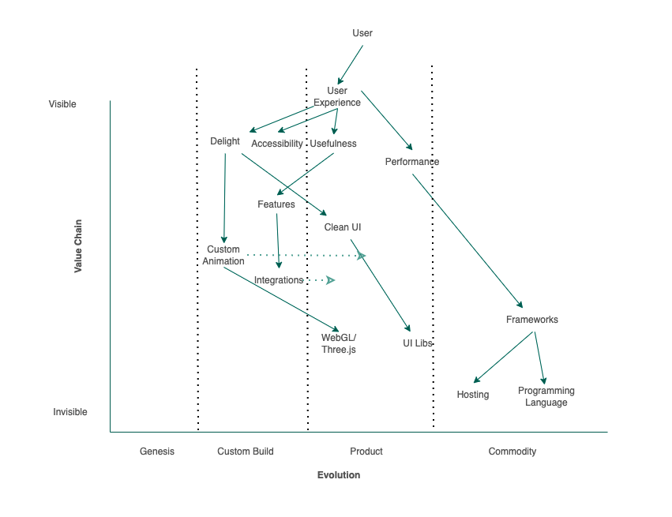
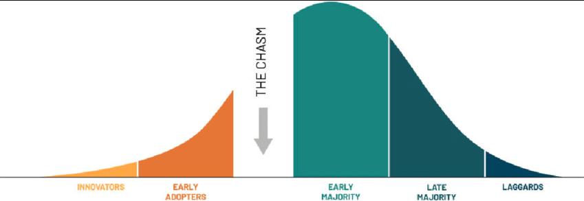
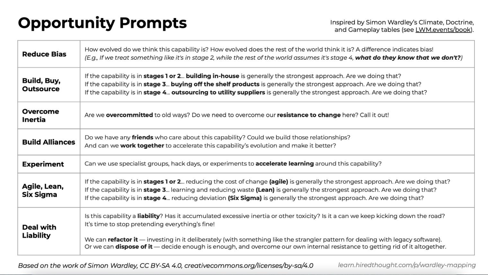

To know what to focus on, you need to first understand the environment that you are operating in. There is always something new to learn and something new to focus on in tech. Most developers I know dive deeply into a topic sheerly because they are interested in it. This is great, but I believe that if you are going to bet your career on a specific technology, you might not want to let this decision up to chance. I wanted to be more proactive and understand what a good compounding skill to learn is. I wanted to think critically about where the web dev ecosystem is now, and I wanted to assess what skills will be very relevant in the next years. The goal is to understand what are the things that I want to focus on and what are the market forces at play, making some bets on technologies riskier than others.

To create the basis for this decision, I went back to my training in business management and started to assess the current Web Dev environment and map it out in a Wardley map. Wardley maps are not very widely known but are very useful. A Wardley map combines several strategic analysis tools: the [Rogers’ Innovation and Adoption Curve](https://en.wikipedia.org/wiki/Diffusion_of_innovations) and the fishbone type diagram used to investigate root causes.

## How to read a Wardley map

A Wardley map always has an anchor plotted on the top of the graph. In my graph, this is the user (of a website). The user has needs for the website he is using. In my map, all the user needs are grouped under the umbrella of user experience. The Y-axis goes from visible to the user to invisible. For example, the user experience is dependent on the website's performance. The website’s performance is dependent on the frameworks that you use. The performance is visible from a user’s point of view, the underlying web framework less so. The framework or even the hosting or the used programming language is invisible to the user, but the choices made in these areas affect him nonetheless.

On the X-axis, we assess the level of maturity of each item. It is similar to the Rogers Curve as it assumes that everything has a life cycle where items move from the innovator's section to the early adopters. Geoffrey Moore introduced the idea of the chasm between early adopters and the early majority, showing that is exponentially more difficult for a product to go “mainstream” and jumping from the early adopter's phase to the early majority phase. Comparatively, one can imagine that the jump for a product or technology from the early majority to the late majority is quite simple.

On a Wardley map, we place the selected items on the x-axis, which corresponds to the position of the item on the Roger’s Curve. So, for example, in my map, I added delight to the custom-built section as I believe that if you want to add delight to your user experience, it has to be somewhat special and novel. It has to be custom-built and cannot be a cookie-cutter project to achieve this. The user needs to be happy to see this new feature, and therefore, it has also to be new to him (this assumption is based on the [KANO](https://www.productplan.com/glossary/kano-model) model used for prioritizing features on a product roadmap).

In the same way, I think you can get performance off the shelf (at least to a degree- nothing can save you from bad coding practices 😉). I think about performance as a product because if I stick to good industry practices, I can get some optimizations of the shelf. One example of this is the recent release of React 18. Upgrading from React 17 to 18 will make your application faster without thinking about how it makes your website faster. It will make it faster because the React core maintainers added concurrent mode. It is all baked into the product or the framework, and you can use the advantages without coming up with the same ideas yourself. If you had a custom framework, you would need to understand how concurrency works on the web and create the tools yourself (custom built).

Note that this is essentially about the “Build vs. Buy” decision. If there are products that do what you need, there is little reason to build your own. Hosting is a clear example of this. It used to be common to have a proprietary data center, but as the technology around hosting matured, we saw that this could be commoditized, and we moved right on the Roger’s curve. Note that, like all items living on the right of this curve, the hosting providers are hardly innovating anymore. They release incremental improvements on their platforms, but the price is the main strategy for competition in a commoditized space. The cheaper they can make the product, the more market share they will take.

## Interpreting the Map - What does it mean

Now that some items are placed on the map, what does it mean? In my map, I tried to answer the question of what skills will be in demand in the coming years. For example, I could specialize in a specific framework, but frameworks are on the far right side of the map. This means that there is a high standardization and that the only differentiation that they compete in is price. Note that the price for frameworks is so low that almost all web frameworks are free. Even for myself trying to specialize in a framework is probably not a great idea. There is a low barrier to entry for newcomers, and therefore there is high competition. I am not saying that as a developer, you do not have to know your frameworks, but if this is your only point of differentiation, then you are competing with many other developers for the same position. You are replaceable, and the only way you get to compete is , as previously stated, on price (i.e., your salary). It is not a differentiating factor, and they will hardly give you a competitive advantage. React as a library has been around for many years now, and all the meta frameworks on those are great, but I would argue we are currently seeing only incremental improvements and not game-changers.

I was looking for items that are about to cross a boundary. Preferably items that go from custom-build to product. The reasoning is that the market is sufficiently mature so that there are already resources out there for me to pick up. Also, these items or technologies have proven useful and successful. Betting on them will be less risky for me as they have already some momentum and a community around them.

I think two items on my map are ready to jump from custom build to product area; one I am more confident in and one less so. These are Integration and Animations.

I am less confident that Integrations will become more productized and standardized in the next years simply because this has been in the custom build section of the map for virtually 30 years. You can never know for sure when an item crosses the chasm, but there are some interesting developments that could signal Integrations will be more standardized. One example of productized integrations is [Zapier](https://zapier.com/explore). Zapier has hundreds of integrations off the shelf and it is very simple to integrate some two tools using it. There are also other examples like GTM, which aggregates all the tracking integrations, but still, to this day, most integrations are custom-built for each website.

I am more confident in the move of animations from custom build to product. With animation, I do not mean small hover effects on a button, but larger animations that feed into a user experience in a major way. For example, consider this website [https://zen.ly/](https://zen.ly/). This animation is not just a small change in the opacity of a button, but the animation is one of the core features of this website. This website is delightful because of the animation. Creating such a website is incredibly hard and beyond the capabilities of most engineers, but again there is some movement that this could be something that can be bought more off the shelf. Consider [Rive](https://rive.app/), which allows you to create similar animations and export them with a GUI. This will make animations much more accessible and more widely used. Not all websites will need these amazing 3D experiences, but check out [Stripe’s Homepage](https://stripe.com/en-mt) for an example of a delightful but subtle animation of a spinning globe. I believe that the category “Animations” are ready to cross the chasm and be more widely accessible.

I thought that working on these animations could be a specialization. There is a lot of movement in the market, a lot of demand for unique experiences, and many tools help move these from custom build to products. This mix of circumstances can make it easier for me to bring more unique skills to the table as a web developer. Also, I hope that specializing in those will pay dividends in the long run as these major animations are becoming more mainstream.

## Biases and Preconceptions

All strategic analysis tools have the limitation that they will allow the author (me) to build his biases and preconceptions of the world into the analysis. This is just the same with this tool. The map represents the world how I see it and not how it really is. However, the main advantage of still performing this exercise is assessing your own biases and discussing what could be added and refined with your community. You can tackle each item individually and ask the following questions:

I posted this graph on Twitter and got some great feedback that I can now work into my map to make my understanding more complete (see the full conversation [here](https://twitter.com/maxklammer/status/1510515945520914437)). I also was able to talk about it in my [Learn in Public](https://www.learninpublic.org/) community, where I was able to collect even more feedback. The most eye-opening feedback I got is that you can make a new map and make your new anchor anything on the map. E.g., If you want to zoom in on integrations, you can put integrations on top and think about what you need: Authentication, Security, Developer Experience, etc. Where are they in their respective life cycle, and are there any areas which are ripe to move from one phase to the next.

It was the first time I made a Wardley map for anything. There are many ways to improve it, but I had a lot of fun, especially since the community around this tool is so helpful. Definitely check out @[HiredThought](https://twitter.com/HiredThought) on Twitter if this sparked your interest.
